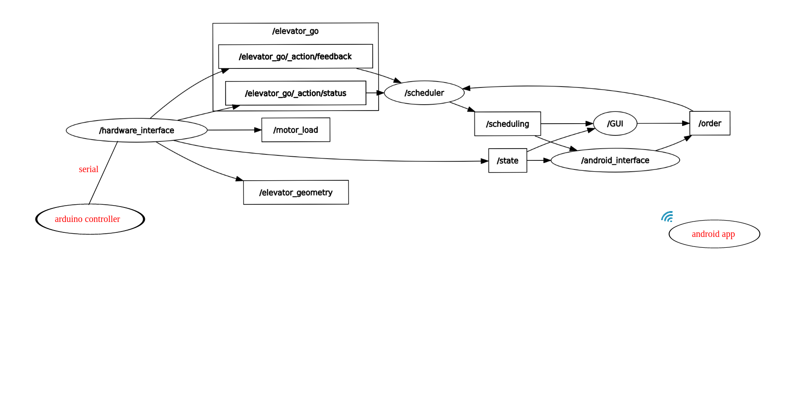

# elevator project
In this project we create a simple elevator that serves three buildings, and has some smart features like: Using ROS2, PID for control , Order-scheduling using first come first served(FCFS) or shortest job first (SJF) with aging ,and Simple GUI to use the elevator

## Hardware

* you can get hardware conponent from [here](media/components.xlsx)
* we used arduino uno.
* and an Ultrasonic to get the position of the elevator (it is better to use encoder)
* and servo motor to rotate the door of the elevator

## software

* Obviously this isn't a comprehensive guide to ROS, you will need to undestand some core concepts before building this. The Robot runs [ROS2 Humble](https://docs.ros.org/en/humble/index.html) on Ubuntu 22.04.

* On the elevator:

