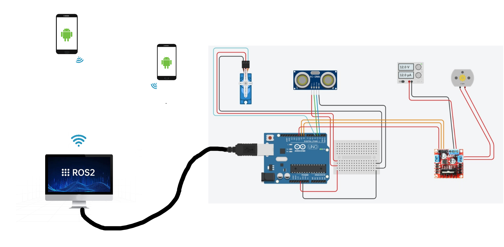
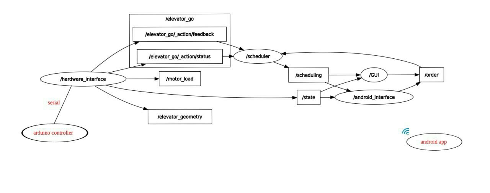

# elevator project
In this project we create a simple elevator that serves three buildings, and has some smart features like: Using ROS2, PID for control , Order-scheduling using first come first served(FCFS) or shortest job first (SJF) with aging ,and Simple GUI to use the elevator

      

## Hardware



* you can get hardware conponents from [here](media/components.csv)
* we used arduino uno.
* and an Ultrasonic to get the position of the elevator (it is better to use encoder)
* and servo motor to rotate the door of the elevator

## software

* Obviously this isn't a comprehensive guide to ROS, you will need to undestand some core concepts before building this. The elevator runs [ROS2 Humble](https://docs.ros.org/en/humble/index.html) on Ubuntu 22.04.

* In our elevator rosGraph:



* [HW_controller](arduino/HW_controller/HW_controller.ino): on ardino that end hardware state to HW_interface node and does whate the node tells it to do through the serial. It use PID control to reach the hieght gaol

* [HW_interface](ROS2_pkg/simple_elevator/src/HW_interface.py) node, is the intermediat between hardware and ros nodes

* [scheduler](ROS2_pkg/simple_elevator/src/scheduler.py) node, is responsible for scheduling usr orders using first come first served(FCFS) or shortest job first (SJF) with aging
you can use what you need by chang the ros parameters values

* [GUI](ROS2_pkg/simple_elevator/src/GUI.py) node, it is a simulation of the input panels found internal and external in elevator.

* [android_interface](ROS2_pkg/simple_elevator/android_interface.py) is the intermediat between android and ros nodes (still worhing on...)

* [mobile app](android) that make user get the servic using it's mobile (still worhing on...)


## How to use

* build your simple_elevator ROS2 package and source it in your terminal then launch it by using:
```
ros2 launch simple_elevator simple_elevator_launch.py
```

## [Watch on youtube](https://youtu.be/9bC5t68XpNU)
